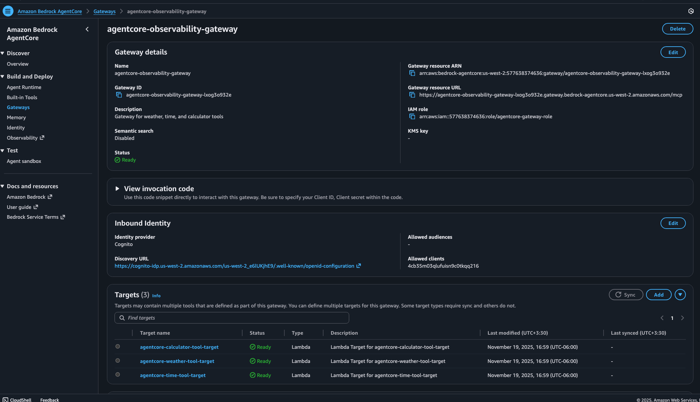
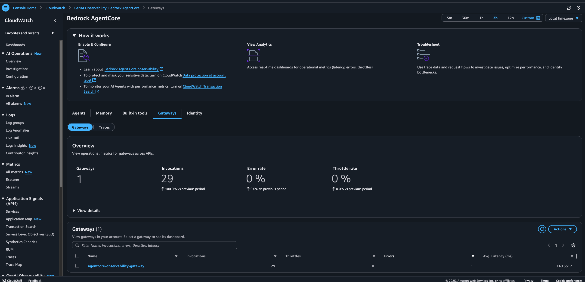
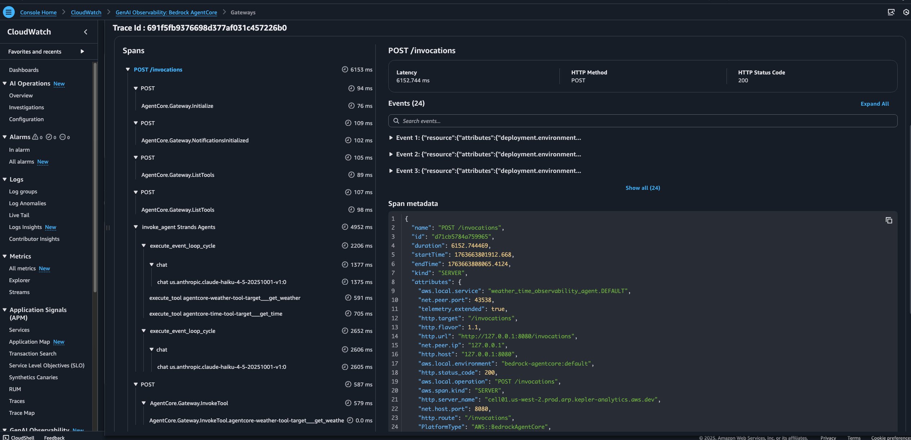

# Dual Observability Guide

## Overview

This guide demonstrates dual-platform observability for Amazon Bedrock AgentCore agents, combining AWS-native CloudWatch monitoring with AI-focused Braintrust analytics.

## What is Dual Observability?

Dual observability provides two complementary views of your agent execution:

1. **CloudWatch Observability (Always Active)**: Infrastructure-level traces automatically provided by AgentCore Runtime
2. **Braintrust Observability (Optional)**: AI-focused traces exported via OpenTelemetry from your Strands agent

## Architecture Overview

### Local Tools Mode
```
Client → AgentCore Runtime → Strands Agent → Local Tools
         ↓                   ↓
    CloudWatch Logs     Braintrust (OTEL)
```

### Gateway Tools Mode
```
Client → AgentCore Runtime → Strands Agent → Gateway → Lambda Functions
         ↓                   ↓               ↓
    CloudWatch Logs     Braintrust (OTEL)  Lambda Logs
```

## Gateway Components

### AgentCore Gateway Setup



The AgentCore Gateway enables production-ready tool scaling by routing tool calls to Lambda functions instead of executing them locally within the agent container.

### Identity and Authentication

Gateway authentication uses Amazon Cognito OAuth to secure tool invocations:
- User Pool creation for identity management
- OAuth client configuration for secure API access
- Token-based authentication for Gateway requests

## Observability Platforms

### CloudWatch Observability




CloudWatch provides infrastructure-level monitoring:
- Automatic trace collection from AgentCore Runtime
- Agent execution metrics and latency
- Tool invocation tracking
- Error rate monitoring

## Getting Started

1. **Deploy Agent**: `scripts/deploy_agent.sh`, make sure you configure the lambda functions and congito if using gateway mode
2. **Enable CloudWatch Tracing**: Manual step in AWS Console
3. **Optional Braintrust**: Set API key for dual observability
4. **Test Scenarios**: Run demo scripts to generate traces
5. **View Results**: Compare insights across both platforms
